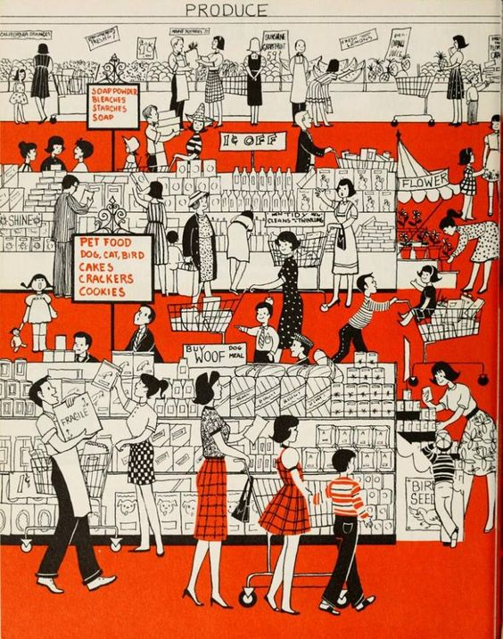

# Supermarket Segmentation Analysis

## Dataset Overview

### Background Supermarket X 
Dataset ini mencakup informasi tentang pelanggan dari supermarket X, termasuk data demografis, pembelian produk, promosi yang telah dijalankan dan respons dari pelanggan terhadapnya, serta detail-detail tentang perilaku pembelian dan aktivitas kunjungan pelanggan di situs web supermarket pada tahun 2014.

**People:**
- ID: Identifikasi unik pelanggan
- Year_Birth: Tahun kelahiran pelanggan
- Education: Tingkat pendidikan pelanggan
- Marital_Status: Status perkawinan pelanggan
- Income: Pendapatan tahunan rumah tangga pelanggan
- Kidhome: Jumlah anak dalam rumah tangga pelanggan
- Teenhome: Jumlah remaja dalam rumah tangga pelanggan
- Dt_Customer: Tanggal pendaftaran pelanggan dengan perusahaan
- Recency: Jumlah hari sejak pembelian terakhir pelanggan
- Complain: 1 jika pelanggan mengeluh dalam 2 tahun terakhir, 0 jika tidak

**Product**
- MntWines: Jumlah yang dihabiskan untuk anggur dalam 2 tahun terakhir
- MntFruits: Jumlah yang dihabiskan untuk buah-buahan dalam 2 tahun terakhir
- MntMeatProducts: Jumlah yang dihabiskan untuk produk daging dalam 2 tahun terakhir
- MntFishProducts: Jumlah yang dihabiskan untuk produk ikan dalam 2 tahun terakhir
- MntSweetProducts: Jumlah yang dihabiskan untuk permen dalam 2 tahun terakhir
- MntGoldProds: Jumlah yang dihabiskan untuk emas dalam 2 tahun terakhir

**Promotion**
- NumDealsPurchases: Jumlah pembelian dengan diskon
- AcceptedCmp1: 1 jika pelanggan menerima tawaran dalam kampanye pertama, 0 jika tidak
- AcceptedCmp2: 1 jika pelanggan menerima tawaran dalam kampanye kedua, 0 jika tidak
- AcceptedCmp3: 1 jika pelanggan menerima tawaran dalam kampanye ketiga, 0 jika tidak
- AcceptedCmp4: 1 jika pelanggan menerima tawaran dalam kampanye keempat, 0 jika tidak
- AcceptedCmp5: 1 jika pelanggan menerima tawaran dalam kampanye kelima, 0 jika tidak
- Response: 1 jika pelanggan menerima tawaran dalam kampanye terakhir, 0 jika tidak

**Place**
- NumWebPurchases: Jumlah pembelian melalui situs web perusahaan
- NumCatalogPurchases: Jumlah pembelian menggunakan katalog
- NumStorePurchases: Jumlah pembelian langsung di toko
- NumWebVisitsMonth: Jumlah kunjungan ke situs web perusahaan dalam sebulan terakhir

### Background Problem
Supermarket X, di masa lalu memiliki masalah dengan program kampanye yang kurang menarik bagi anggotanya. Penyebabnya mungkin karena kurangnya daya tarik kampanye, kurangnya personalisasi dalam penawaran, atau ketidakpahaman tentang preferensi anggota. Namun, kampanye terakhir berhasil menarik lebih banyak pelanggan. Meskipun begitu, manajemen menyadari perlunya terus mengembangkan strategi kampanye yang efektif untuk mempertahankan minat anggota yang sudah ada. Mereka juga mengamati penurunan minat bergabung dalam keanggotaan yang perlu diatasi dengan pemahaman yang lebih baik tentang berbagai segmen pelanggan mereka. Dengan analisis segmentasi pasar, supermarket X dapat mengidentifikasi kelompok pelanggan dengan karakteristik serupa, membantu mereka mengembangkan strategi kampanye yang lebih efektif. Ini akan memungkinkan mereka menghadapi penurunan minat pelanggan dengan lebih baik di masa depan.

## Business Task
### Permasalahan Utama
Manajemen ingin menemukan cara untuk meningkatkan program kampanye mereka agar dapat mencegah penurunan minat pelanggan dalam bergabung dalam program membership, sambil juga membuat program kampanye lebih efektif dan relevan berdasarkan preferensi pelanggan, sehingga anggota yang sudah ada tetap aktif bertransaksi dan memberikan keuntungan yang lebih besar dan untuk pelanggan yang belum bergabung pada program membership ini dapat bergabung

### Rumusan Masalah
Tahapan untuk melakukan analisis:    
1. Identifikasi berbagai segmen pasar berdasarkan kategori yang relevan.  
    - Apakah terdapat hubungan antara Recency Customer dengan Minat Belanja?
    - Bagaimana pendapatan dapat mempengaruhi pola belanja pelanggan supermarket?
    - Apakah perbedaan Background Edukasi dapat mempengaruhi preferensi dan minat berbelanja?
    - Apakah ada korelasi antara usia dengan preferensi dan minat berbelanja?
    - Apakah pelanggan yang sudah menikah cenderung berbelanja lebih besar daripada pelanggan yang belum menikah?
    - Apakah pelanggan yang sudah memiliki anak dapat mempengaruhi pola berbelanja?
2. Evaluasi saluran pemasaran yang paling efisien.    
3. Memberikan kesimpulan dan rekomendasi strategi pemasaran.  
